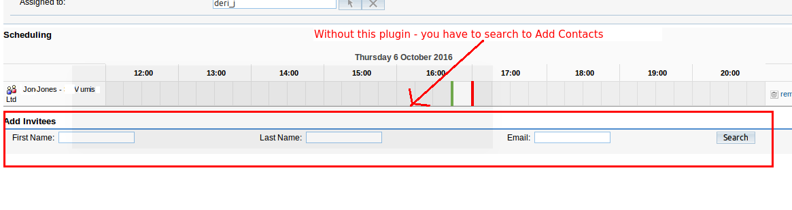

# SuiteCRM_UI___Contacts-selection_with_less_clicks
In SuiteCRM when the user is creating a Meeting or Call, it is normally necessary to use search to find the right Contacts to add. This is slow. (SugarCRM CE is the same). 

This project is a SuiteCRM plugin, that adds a combo of Contacts in the Meeting &amp; Call page:  from which the user can quickly click to select one or more contacts.  The combo is populated with Contacts from only the relevant Account - so a nice short selection.  Either (a) for Calls/Meetings that are are related to an Account  - it will be contacts from the same account OR (b) for Calls/Meetings linked to an Opportunity, the contacts will be from the Account which the Opportunity is linked too.   

The code works every day on a SugarcRM 6.5 CE version, hosted by salesAgility. And was written to also work in current SuiteCRM.

NOTE:  We did not write this code - but did pay for it be written under a contract that stated it would be open-sourced:  and this repository is simply to make it available to all.

ScreenShots
===========

Without this plugin, the user is forced to Search for Contacts to add, at bottom of page:

